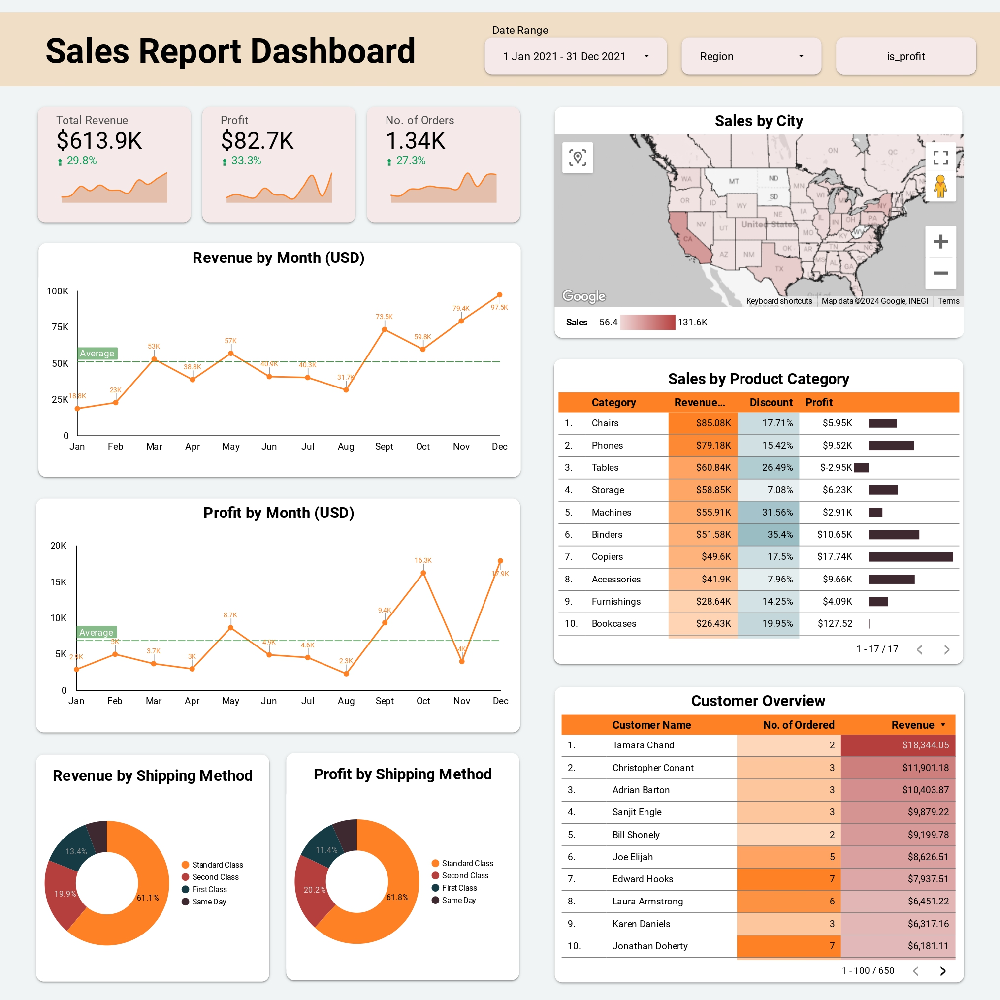

# Sales Report Dashboard
Dataset: You can download [here](https://docs.google.com/spreadsheets/d/1wwcaGVHV4afDBdCAv-Qb7QSDwbtGOLf1Au1y44VJXfQ/edit?usp=sharing).\
Dashboard: The dashboard is available [here](https://lookerstudio.google.com/reporting/0c3d7314-f991-4c94-a477-f62ba2a36713).

## Dashboard Overview

## Insights and Recommendations
1. Monthly Revenue and Profit Trends\
Insight:\
Monthly revenue shows a rising trend from January to December, with the lowest revenue in January ($18.8K) and the highest in December ($97.5K). Profit also peaks notably in August ($17.9K), despite some fluctuations in other months. This increase likely reflects high demand towards the end of the year, typically driven by holiday shopping momentum.\
Recommendation:\
To maximize gains, a targeted promotion strategy during these peak months could be beneficial, such as bundling offers or upselling tactics that increase transaction value without heavy discounting that impacts profit margins. Considering the significant profit spike in August, further analysis of factors driving this could yield insights to inform future strategies.

2. Mixed Performance Across Product Categories\
Insight:\
Product categories Chairs, Phones, and Tables lead in revenue; however, Tables shows a negative profit, likely due to high discount rates. Conversely, Copiers demonstrate solid profitability, ranking in the top 7 for revenue with relatively low discounts.\
Recommendation:\
To improve discount spending efficiency, it’s advisable to reallocate part of the discount budget from lower-performing products like Tables to high-margin products like Copiers, which may attract more sales with additional discount incentives. This approach would optimize the discount budget, drive up sales volume, and ultimately enhance profitability.

3. Shipping Method Profitability\
Insight:\
The Standard Class shipping method dominates in both revenue (61.1%) and profit (61.8%), indicating that customers favor the more economical shipping option over premium methods. This preference for Standard Class suggests price sensitivity around shipping costs.\
Recommendation:\
To maintain the profit contribution from this method, the company could consider introducing incentives like reduced shipping fees for orders over a certain amount, keeping customers attracted to the Standard Class while preserving margins.

4. Strategic Opportunities by Sales Region\
Insight:\
California and New York rank highest in sales, generating $131K and $71.8K in revenue, respectively. These regions present prime opportunities for targeted marketing campaigns, such as location-specific advertising or loyalty programs to encourage repeat purchases.\
Recommendation:\
Given the substantial market potential in these regions, focusing campaigns on California and New York’s loyal customer base can enhance retention, while additional marketing efforts can attract new customers. This strategy not only boosts revenue but also fosters long-term customer loyalty in these high-potential regions.\
This analysis highlights several strategic approaches to increase revenue, profitability, and discount efficiency, based on observed sales trends and patterns. It considers customer preferences in shipping methods, regional sales potential, and targeted discount reallocation, providing actionable insights to drive optimal business outcomes.
